# Лабораторная работа №6. Система контроля версий  

**Студент:** Николаев Алексей

**Группа:** 4314  

---
# Описание работы
**Цель работы**: изучение базовых возможностей системы
управления версиями, опыт работы с Git Api, опыт работы с локальным и
удаленным репозиторием. 

---

## Содержание
1. [Создание копии репозитория в личном хранилище](#1-создание-копии-репозитория-в-личном-хранилище)
2. [Настройка клиента Git](#2-настройка-клиента-git)
3. [Клонирование личного удалённого репозитория на компьютер](#3-клонирование-личного-удалённого-репозитория-на-компьютер)
4. [Добавление файла через интерфейс GitHub](#4-добавление-файла-через-интерфейс-github)
5. [Получение истории операций для каждой из веток](#5-получение-истории-операций-для-каждой-из-веток)
6. [Просмотр последних изменений](#6-просмотр-последних-изменений)
7. [Слияние в ветку master, разрешение конфликта](#7-слияние-в-ветку-master-разрешение-конфликта)
8. [Удаление побочной ветки после успешного слияния](#8-удаление-побочной-ветки-после-успешного-слияния)
9. [Внесение изменений и их фиксация с комментариями](#9-внесение-изменений-и-их-фиксация-с-комментариями)
10. [Откат коммита](#10-откат-коммита)
11. [Создание ветки для отчёта](#11-создание-ветки-для-отчёта)
12. [Получение истории операций в форматированном виде](#12-получение-истории-операций-в-форматированном-виде)
13. [Отправка локальных изменений в сетевое хранилище GitHub](#13-отправка-локальных-изменений-в-сетевое-хранилище-github)

---

### 1. Создание копии репозитория в личном хранилище

Переходим в оригинальный репозиторий [LR6](https://github.com/Kurtyanik/LR6), нажимаем **Fork**, после чего выполняем операцию **Create a new fork**, чтобы создать копию репозитория в своём аккаунте.

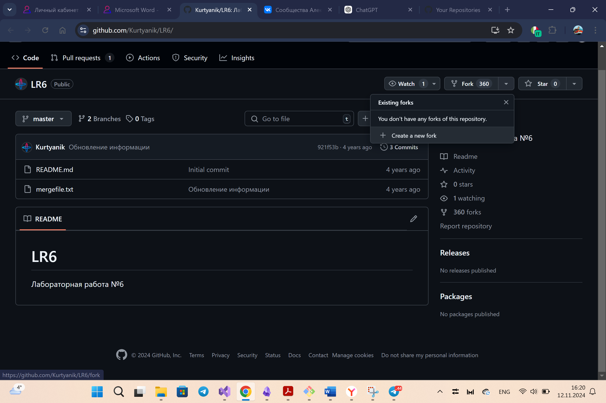

---

### 2. Настройка клиента Git

После того, как Git был установлен на компьютер, дальнейшая работа будет осуществляться через Git Bash.

	Git Bash — это терминал (или командная строка), который предоставляет инструменты для работы с Git в операционной системе Windows. Он включает в себя как команды Git, так и популярные команды Unix/Linux, такие как `ls`, `cat`, `rm`, и другие.

	Git Bash предназначен для разработчиков, которые хотят использовать Git и Unix-стиль командной строки в Windows, не прибегая к дополнительным инструментам или операционным системам, как Linux или macOS.

Запускаем терминал. Первым шагом настраиваем имя пользователя и email для локального репозитория, через следующие команды:
   ```bash
   git config --global user.name "Группа Фамилия Инициалы"
   git config --global user.email "ваш_email@example.com"
   ```

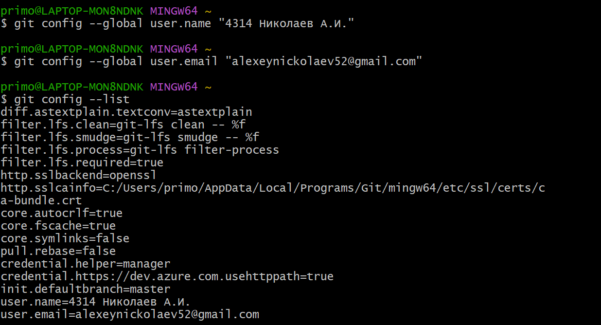

---

### 3. Клонирование личного удалённого репозитория на компьютер

Для работы с репозиторием на локальном компьютере необходимо его клонировать.

1. Копируем URL-адрес репозитория из своего аккаунта на GitHub (кнопка **Code** -> **HTTPS**).
2. Выполняем команду в Git Bash:
```bash
git clone https://github.com/<username>/LR6.git
```
Репозиторий успешно скачивается в локальную папку.

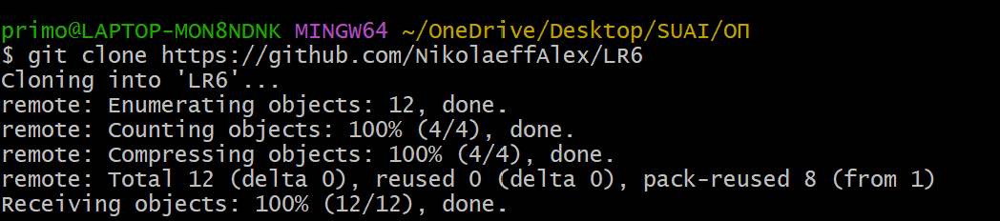

---

### 4. Добавление файла через интерфейс GitHub

Для добавления нового файла через веб-интерфейс GitHub.

1. Переходим в свой репозиторий на GitHub.
2. Нажимаем **Add file** -> **Create new file**.
3. Создаём файл `new_file.txt` и добавляем содержимое.
4. Нажимаем **Commit changes**.

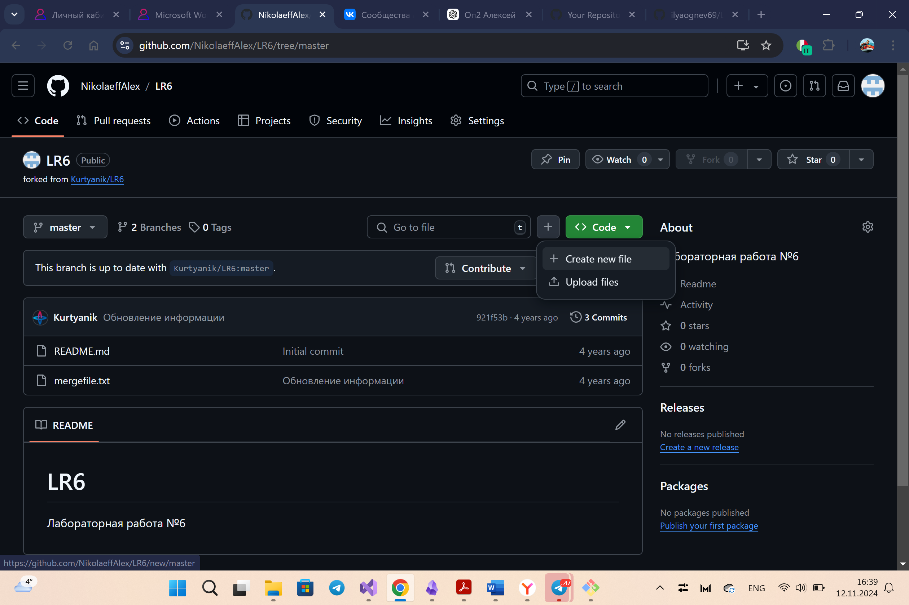 

После добавления файла подтягиваем изменения на локальный компьютер:

   ```bash
   git pull origin master
   ```

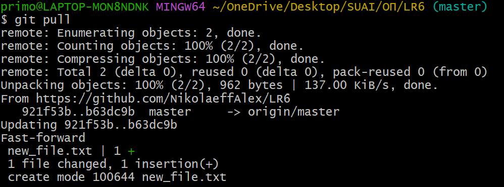 

---

### 5. Получение истории операций для каждой из веток

Для просмотра истории операций в репозитории используется команда `git log`.
Выполняем команду:

```bash 
git log --oneline --all
```

В выводе отображаются коммиты с краткими сообщениями, их хэшами и привязкой к веткам.
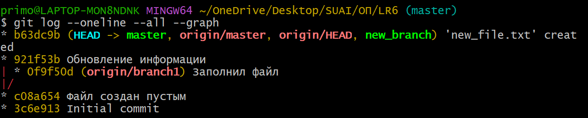

---

### 6. Просмотр последних изменений

Просмотр последних изменений в репозитории осуществляется с помощью команды:

```bash
git log -p -1
```

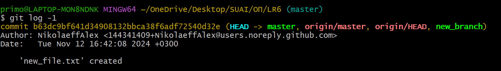

---

### 7. Слияние в ветку master

Для слияния в ветку master создадим побочную ветку new_branch. Для этого используем следующую команду :

```bash
git branch new_branch
```

После этого перейдем в новую ветку через команду:

```bash
git checkout new_branch
```


---

### 8. Удаление побочной ветки после успешного слияния

После выполнения слияния в ветку master удаляем побочную ветку при помощи команды:
   ```bash
   git branch -d new-branch
   ```

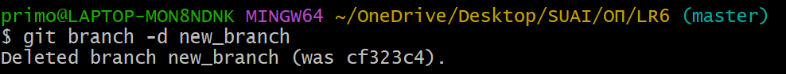

---

### 9. Внесение изменений и их фиксация с комментариями

Добавим несколько изменений в файл `new_file.txt` и зафиксируем каждое в виде отдельного коммита. Вот подробное описание процесса:

1. **Первое изменение:**
   - Добавим текст в файл `new_file.txt`, тем самым внеся изменение первое изменение .
   - Добавляем файл в область подготовки командой:
     ```bash
     git add .
     ```
   - Команда `git status` подтверждает, что файл находится в области подготовки и готов для фиксации:
     ```
     On branch master
     Your branch is ahead of 'origin/master' by 1 commit.
     Changes to be committed:
       modified:   new_file.txt
     ```
   - Изменение было зафиксировано в коммите с описанием "Первое изменение в new_file.txt":
     ```bash
     git commit -m "Первое изменение в new_file.txt"
     ```

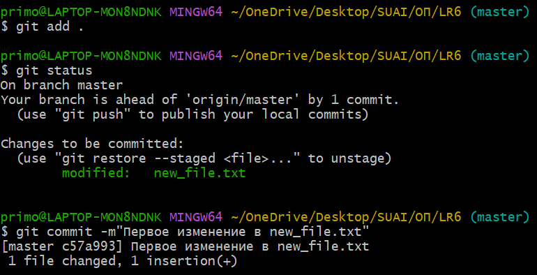

По аналогии с первым изменением добавим в new_file.txt еще текста и зафиксируем изменение.
- Добавляем измененный файл в область подготовки
     ```bash
     git add .
     ```
   - Отслеживаем статус через `git status`
   - Фиксируем изменение добавив соответствующий комментарий:
     ```bash
     git commit -m "Второе изменение в new_file.txt"
     ```
   - Результат:
     ```
     [master a5f38fa] Второе изменение в new_file.txt
      1 file changed, 1 insertion(+)
     ```


---

### 10. Откат коммита

Сделаем еще один коммит и сделаем его откат:

1. Создаем новый коммит:

```bash
git commit -m"Третье изменение в файл new_file.txt"
```

2. Используем команду `git revert` для выполнения отката:

```bash
git revert <хэш_коммита>
```

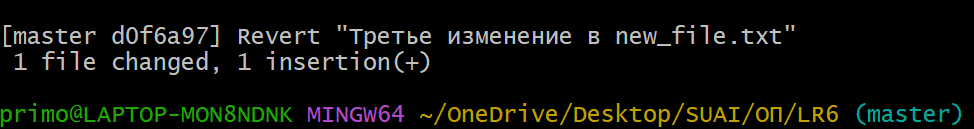
Это создаст новый коммит с изменениями, которые отменяют указанный коммит.

---

### 11. Создание ветки для отчёта

Ветку для отчета создадим при помощи команды:

   ```bash
   git checkout -b report
   ```

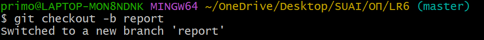

---

### 12. Получение истории операций в форматированном виде

Получил историю операций в формате "сокращённый хэш + дата + имя автора + комментарий":
   ```bash
   git log --pretty=format:"%h %ad %ad %s" --date=short
   ```

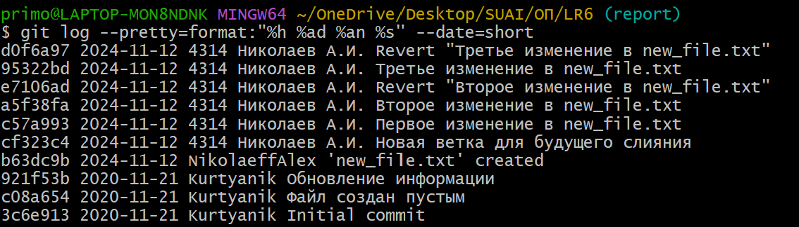

Получаем всю историю операций в форматированном виде.

---

### 13. Отправка локальных изменений в сетевое хранилище GitHub

1. Отправил изменения из основной ветки:
   ```bash
   git push origin master
   ```
2. Отправил изменения из ветки `report`:
   ```bash
   git push origin report
   ```

**Скриншот:**  


---

## Вывод

В ходе выполнения лабораторной работы были изучены основные возможности системы контроля версий Git, а также приобретены практические навыки работы с локальными и удалёнными репозиториями. Выполнено клонирование репозитория, создание веток, внесение изменений и их фиксация, а также разрешение конфликта при слиянии веток. Были освоены команды для просмотра истории операций, отмены коммитов и синхронизации с удалённым репозиторием. Итогом работы стало создание отчёта с описанием всех выполненных действий.