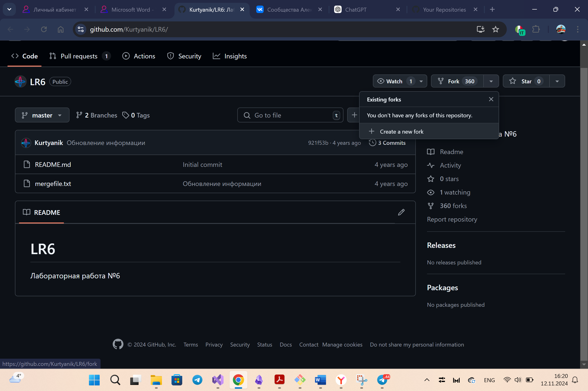
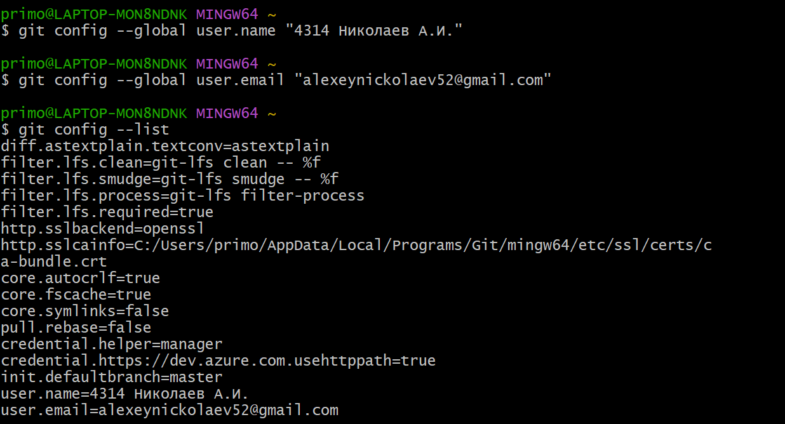
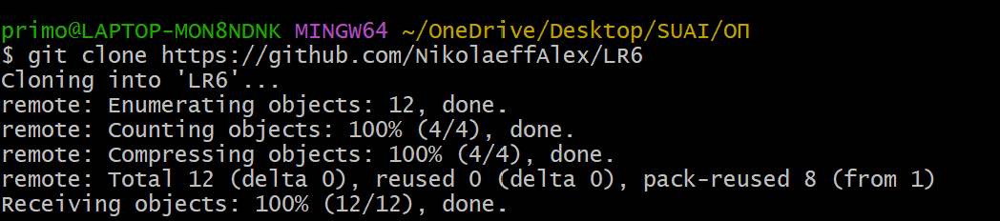
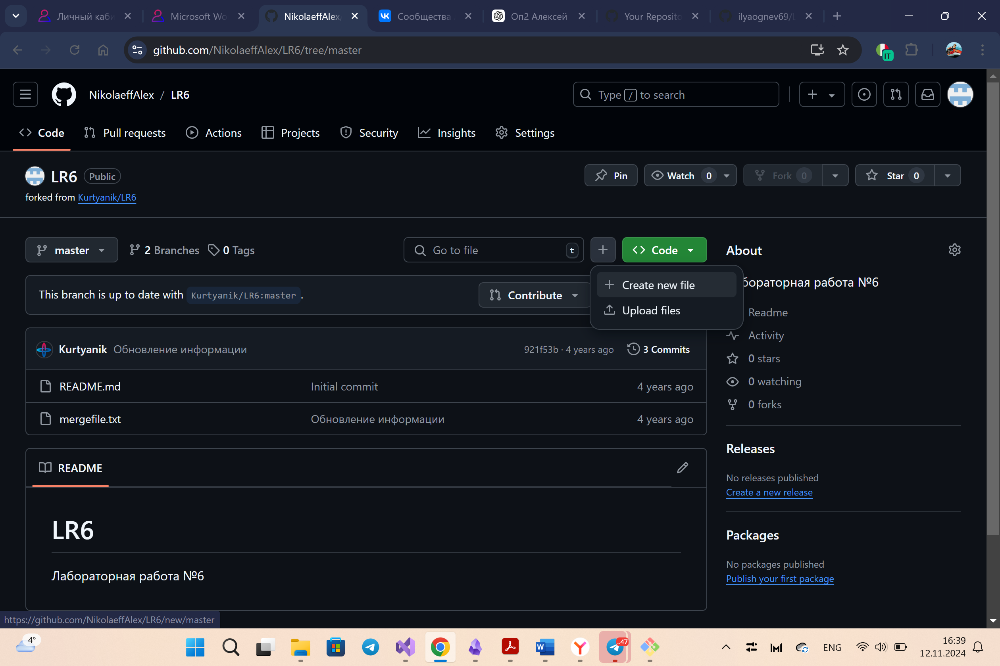
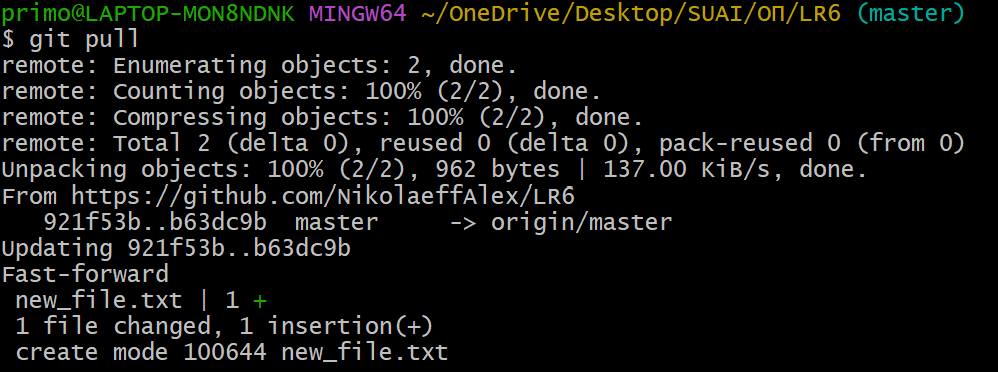
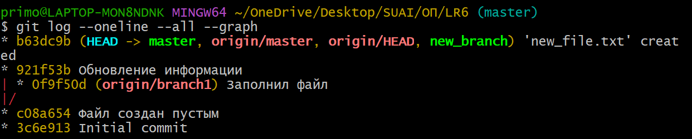
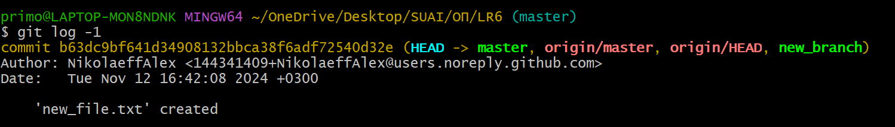

# Лабораторная работа №6. Система контроля версий  

**Студент:** Николаев Алексей

**Группа:** 4314  

---
# Описание работы
**Цель работы**: изучение базовых возможностей системы
управления версиями, опыт работы с Git Api, опыт работы с локальным и
удаленным репозиторием. 

---

## Содержание
1. [Создание копии репозитория в личном хранилище](#1-создание-копии-репозитория-в-личном-хранилище)
2. [Настройка клиента Git](#2-настройка-клиента-git)
3. [Клонирование личного удалённого репозитория на компьютер](#3-клонирование-личного-удалённого-репозитория-на-компьютер)
4. [Добавление файла через интерфейс GitHub](#4-добавление-файла-через-интерфейс-github)
5. [Получение истории операций для каждой из веток](#5-получение-истории-операций-для-каждой-из-веток)
6. [Просмотр последних изменений](#6-просмотр-последних-изменений)
7. [Слияние в ветку master, разрешение конфликта](#7-слияние-в-ветку-master-разрешение-конфликта)
8. [Удаление побочной ветки после успешного слияния](#8-удаление-побочной-ветки-после-успешного-слияния)
9. [Внесение изменений и их фиксация с комментариями](#9-внесение-изменений-и-их-фиксация-с-комментариями)
10. [Откат коммита](#10-откат-коммита)
11. [Создание ветки для отчёта](#11-создание-ветки-для-отчёта)
12. [Получение истории операций в форматированном виде](#12-получение-истории-операций-в-форматированном-виде)
13. [Отправка локальных изменений в сетевое хранилище GitHub](#13-отправка-локальных-изменений-в-сетевое-хранилище-github)

---

### 1. Создание копии репозитория в личном хранилище

Переходим в оригинальный репозиторий [LR6](https://github.com/Kurtyanik/LR6), нажимаем **Fork**, после чего выполняем операцию **Create a new fork**, чтобы создать копию репозитория в своём аккаунте.



---

### 2. Настройка клиента Git

После того, как Git был установлен на компьютер, дальнейшая работа будет осуществляться через Git Bash.

	Git Bash — это терминал (или командная строка), который предоставляет инструменты для работы с Git в операционной системе Windows. Он включает в себя как команды Git, так и популярные команды Unix/Linux, такие как `ls`, `cat`, `rm`, и другие.

	Git Bash предназначен для разработчиков, которые хотят использовать Git и Unix-стиль командной строки в Windows, не прибегая к дополнительным инструментам или операционным системам, как Linux или macOS.

Запускаем терминал. Первым шагом настраиваем имя пользователя и email для локального репозитория, через следующие команды:
   ```bash
   git config --global user.name "Группа Фамилия Инициалы"
   git config --global user.email "ваш_email@example.com"
   ```



---

### 3. Клонирование личного удалённого репозитория на компьютер

Для работы с репозиторием на локальном компьютере необходимо его клонировать.

1. Копируем URL-адрес репозитория из своего аккаунта на GitHub (кнопка **Code** -> **HTTPS**).
2. Выполняем команду в Git Bash:
```bash
git clone https://github.com/<username>/LR6.git
```
Репозиторий успешно скачивается в локальную папку.



---

### 4. Добавление файла через интерфейс GitHub

Для добавления нового файла через веб-интерфейс GitHub.

1. Переходим в свой репозиторий на GitHub.
2. Нажимаем **Add file** -> **Create new file**.
3. Создаём файл `new_file.txt` и добавляем содержимое.
4. Нажимаем **Commit changes**.

 

После добавления файла подтягиваем изменения на локальный компьютер:

   ```bash
   git pull origin master
   ```

 

---

### 5. Получение истории операций для каждой из веток

Для просмотра истории операций в репозитории используется команда `git log`.
Выполняем команду:

```bash 
git log --oneline --all
```

В выводе отображаются коммиты с краткими сообщениями, их хэшами и привязкой к веткам.


---

### 6. Просмотр последних изменений

Просмотр последних изменений в репозитории осуществляется с помощью команды:

```bash
git log -p -1
```



---

### 7. Слияние в ветку master

Для слияния в ветку master создадим


---

### 8. Удаление побочной ветки после успешного слияния

1. Удалил побочную ветку, так как она больше не нужна:
   ```bash
   git branch -d new-branch
   ```

**Скриншот:**  


---

### 9. Внесение изменений и их фиксация с комментариями

1. Внёс изменения в файл `README.md`.
2. Зафиксировал изменения с комментариями:
   ```bash
   git add README.md
   git commit -m "Добавлено описание шагов в README.md"
   ```

**Скриншот:**  


---

### 10. Откат коммита

1. Отменил последний коммит, сохранив изменения в файлах:
   ```bash
   git reset --soft HEAD~1
   ```

**Скриншот:**  


---

### 11. Создание ветки для отчёта

1. Создал новую ветку для работы над отчётом:
   ```bash
   git checkout -b report
   ```

**Скриншот:**  


---

### 12. Получение истории операций в форматированном виде

1. Получил историю операций в формате "сокращённый хэш + дата + имя автора + комментарий":
   ```bash
   git log --pretty=format:"%h %ad | %s [%an]" --date=short
   ```

**Пример:**
```plaintext
a1b2c3 2024-11-13 | Добавлен файл README.md [Николаев Алексей]
d4e5f6 2024-11-12 | Resolve merge conflict in conflict_file.txt [Николаев Алексей]
```

**Скриншот:**  


---

### 13. Отправка локальных изменений в сетевое хранилище GitHub

1. Отправил изменения из основной ветки:
   ```bash
   git push origin master
   ```
2. Отправил изменения из ветки `report`:
   ```bash
   git push origin report
   ```

**Скриншот:**  


---

## Итог
Лабораторная работа выполнена. Все шаги были последовательно выполнены, конфликты созданы и разрешены, локальный и удалённый репозитории синхронизированы. 